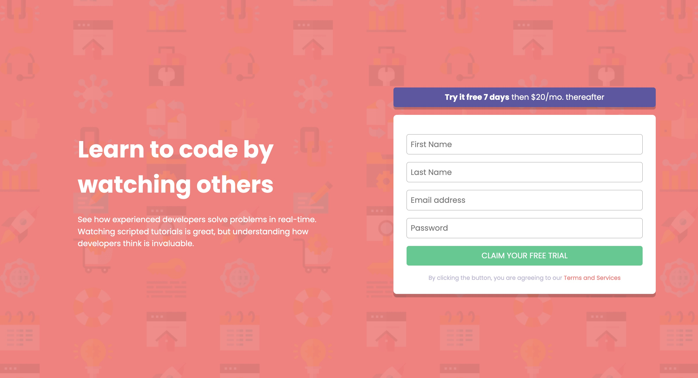

# Frontend Mentor - Intro component with sign up form solution

This is a solution to the [Intro component with sign up form challenge on Frontend Mentor](https://www.frontendmentor.io/challenges/intro-component-with-signup-form-5cf91bd49edda32581d28fd1). Frontend Mentor challenges help you improve your coding skills by building realistic projects. 

## Table of contents

- [Overview](#overview)
  - [The challenge](#the-challenge)
  - [Screenshot](#screenshot)
  - [Links](#links)
- [My process](#my-process)
  - [Built with](#built-with)
  - [What I learned](#what-i-learned)
  - [Continued development](#continued-development)
  - [Useful resources](#useful-resources)
- [Author](#author)
- [Acknowledgments](#acknowledgments)

## Overview

### The challenge

Users should be able to:

- View the optimal layout for the site depending on their device's screen size
- See hover states for all interactive elements on the page
- Receive an error message when the `form` is submitted if:
  - Any `input` field is empty. The message for this error should say *"[Field Name] cannot be empty"*
  - The email address is not formatted correctly (i.e. a correct email address should have this structure: `name@host.tld`). The message for this error should say *"Looks like this is not an email"*

### Screenshot

### Links

- Solution URL: [Add solution URL here](https://your-solution-url.com)
- Live Site URL: [Add live site URL here](https://your-live-site-url.com)

## My process

I started out simply with the HTML and building out the layout that I had in mind. Then I started to arrange the Elements with CSS and give them some Form and the right look. And then I actually used JavaScript the first time within a website. I have a coding background from university but I didn't really know how to use it to manipulate the DOM and add styles to existing CSS rules. But I think I got the job done for the first time. I doubt that this is the right way to make the form show you that something was typed in wrong and I'm happy to get told how to do it better. 

### Built with

- Semantic HTML5 markup
- CSS custom properties
- Flexbox
- Mobile-first workflow
-JavaScript

### What I learned

As told above this was the first time using JavaScript to manipulate the DOM. I learned how to pull the right elements with document.getElementbyID() or document.getElementsByClass(). All the other stuff I did in index.js was basically just handling the provided data from my HTML Elements.

### Useful resources

- [Playlist from freeCodeCamp about Javascript and the HTML DOM](https://www.youtube.com/watch?v=eaLKqoB9Fu0&list=PLWKjhJtqVAbllLK6r2dnGjUVWB_cFNcuO&index=1) - This was a good introduction to JavaScript being used to manipulate the DOM.

## Author

- Frontend Mentor - [@kzowada](https://www.frontendmentor.io/profile/kzowada)
- My Github       - [@kzowada](https://github.com/kzowada?tab=repositories)
